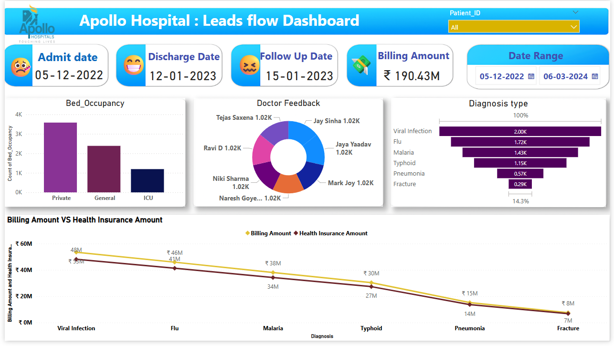

# 📊 Healthcare Analytics Dashboard – Power BI

## 🏥 Project Overview

This Power BI dashboard presents an interactive, data-driven overview of key healthcare metrics. It is designed to help stakeholders—such as hospital administrators, policymakers, and analysts—gain insights into patient outcomes, operational performance, and resource utilization.

---

## 📌 Features

- ✅ **Patient Metrics** – Admissions, discharges, readmission rates  
- 🏥 **Hospital Performance** – Bed occupancy rate, average length of stay  
- 💉 **Medical Trends** – Most common procedures, diagnosis categories  
- 🧪 **Clinical Efficiency** – Lab turnaround time, surgery scheduling  
- 📈 **Time Series Analysis** – Monthly and yearly healthcare trends  
- 🎯 **Interactive Filters** – By department, physician, region, and time period

---

## 🗂️ Pages / Tabs

1. **Overview** – Summary KPIs and charts for quick insights  
2. **Patient Demographics** – Age, gender, location breakdown  
3. **Departmental Performance** – Department-wise efficiency & metrics  
4. **Operational Insights** – Bed usage, ER wait times, staff availability  
5. **Trends & Forecasts** – Time-based analysis and predictive trends

---

## 🛠️ Tools & Technologies

- **Power BI Desktop, Excel**  
- Data source: (To be specified – e.g., CSV, SQL Server, Excel)  
- DAX (Data Analysis Expressions) for metrics and calculated columns  
- Power Query for ETL (Extract, Transform, Load)

---

## 🔧 How to Use

1. **Download** the `.pbix` file.
2. Open it using **Power BI Desktop**.
3. Ensure data source paths are correctly set if local files are used.
4. Interact with slicers and filters for dynamic views.
5. Publish to Power BI Service for sharing or scheduled refresh.

---

## 📍 Notes

- This dashboard is optimized for decision support and not diagnostic use.
- All data shown are anonymized or synthetic (if demo version).
- Ensure compliance with healthcare privacy regulations (e.g., HIPAA, GDPR).

---

## 🖼️ Dashboard Preview

